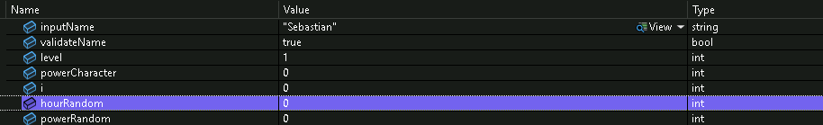
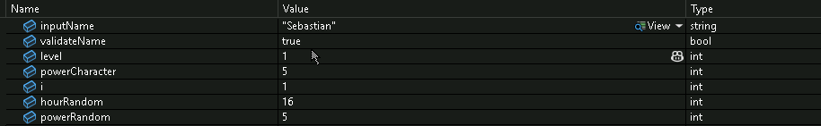
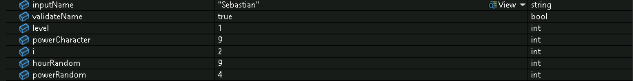
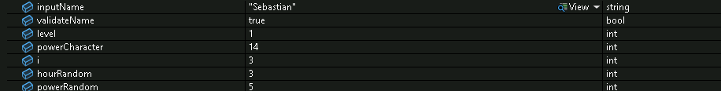
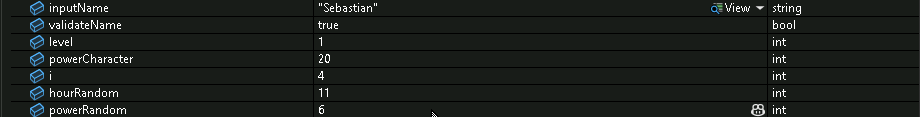
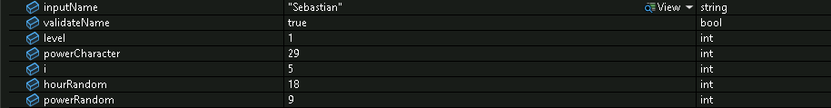

# ⚔️  Descripcion y juego de pruebas 

## Chapter 1. El camino del mago aprendiendo 🧙‍♀️
En este primer capítulo de CodeQuest, donde el jugador inicia  su aventura como un aprendiz de mago.
Al iniciar, el programa muestra un menú con varias opciones, pero laen este caso hablaremos de la primera opción "Train your wizard".

Cuando eliges entrenar, el juego te pide que escribas tu nombre como si fueras tú mismo el personaje y después simula varios días de práctica mágica.
Durante ese tiempo, el mago va ganando poder poco a poco y al final según lo que haya entrenado, recibe un título especial.

Para lograr esto, utilicé un bucle for que representa los días de entrenamiento.
En cada día, el juego genera valores aleatorios con Random para simular el poder obtenido y la hora del día. Además, añadí pausas con Thread.Sleep().

Al finalizar el entrenamiento, el código usa estructuras if y else if para comparar la cantidad total de poder del jugador.
Dependiendo del resultado, muestra un mensaje distinto con el nivel alcanzado.

Tambien hice uso Regex  para asegurarme de que el nombre solo contenga letras.

## Juego de pruebas
### Iteracion : 1 

### Iteracion : 2

### Iteracion : 3

### Iteracion : 4

### Iteracion : 5

### Iteracion : 6    

