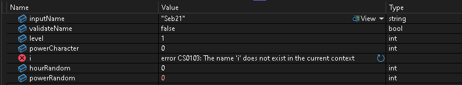
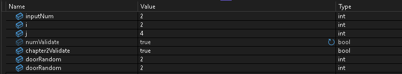
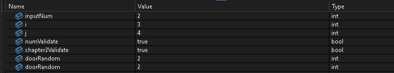
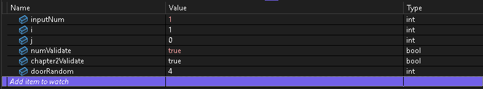
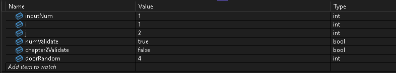
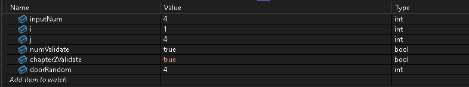
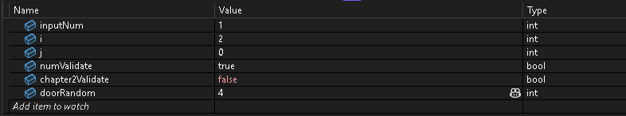
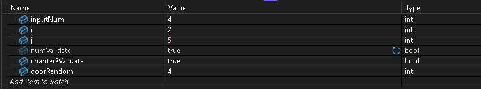

# ⚔️  Descripcion y juego de pruebas 

## Chapter 1. El camino del mago aprendiendo 🧙‍♀️
En este primer capítulo de CodeQuest, donde el jugador inicia  su aventura como un aprendiz de mago.
Al iniciar, el programa muestra un menú con varias opciones, pero laen este caso hablaremos de la primera opción "Train your wizard".

Cuando eliges entrenar, el juego te pide que escribas tu nombre como si fueras tú mismo el personaje y después simula varios días de práctica mágica.
Durante ese tiempo, el mago va ganando poder poco a poco y al final según lo que haya entrenado, recibe un título especial.

Para lograr esto, utilicé un bucle for que representa los días de entrenamiento.
En cada día, el juego genera valores aleatorios con Random para simular el poder obtenido y la hora del día. Además, añadí pausas con Thread.Sleep().

Al finalizar el entrenamiento, el código usa estructuras if y else if para comparar la cantidad total de poder del jugador.
Dependiendo del resultado, muestra un mensaje distinto con el nivel alcanzado.

Tambien hice uso Regex  para asegurarme de que el nombre solo contenga letras.

## Juego de pruebas - Caso normal
#### Iteracion : 1 

#### Iteracion : 2

#### Iteracion : 3

#### Iteracion : 4

#### Iteracion : 5

#### Iteracion : 6    

## Juego de pruebas - Caso de errror 

## Chapter 2. El calabozo del Dragón RAMÓN el Poderoso 🐉
En este segundo capítulo, el mago entra en el calabozo del dragón Ramón, donde debe adivinar el código secreto de cada puerta para poder avanzar. En total hay tres puertas, y cuenta con tres intentos por cada una.

El juego muestra las puertas (Character2Doors) y, mediante un bucle for, me hace pasar por cada una. Además, se utiliza otro for interno para controlar los intentos disponibles por puerta.

En cada puerta tengo tres oportunidades para adivinar el número correcto (del 1 al 5).
Si acierto, el dragón me permite avanzar y el programa muestra un mensaje en verde;
si fallo, aparece uno en rojo y pierdo un intento.

Cuando se agotan todos los intentos en una puerta, el juego termina mostrando un mensaje final.
Pero si logro abrir las tres puertas, aparece la puerta final, y con ella, el paso al siguiente nivel.
## Juego de pruebas - Caso normal
#### Iteracion : 1 
.png)
#### Iteracion : 2

#### Iteracion : 3

## Juego de pruebas - Caso error
#### Iteracion : 1 

#### Iteracion : 2

#### Iteracion : 3

## Juego de pruebas - Caso limit
#### Iteracion : 1 

#### Iteracion : 2

#### Iteracion : 3

#### Iteracion : 4

#### Iteracion : 5

#### Iteracion : 6    

#### Iteracion : 7    

#### Iteracion : 8    

#### Iteracion : 9    

## Chapter 3. Lottery the loot 💰
Después de derrotar al dragón, el mago descubre una mina llena de bitcoins mágicos. Con su pico encantado, comienza a excavar en busca de tesoros digitales ocultos.

El juego comienza mostrando el mensaje de introducción (Chapter3Msg) y, mediante un bucle for, el personaje realiza cinco excavaciones consecutivas. En cada intento, se genera una cantidad aleatoria de bitcoins (entre 0 y 50).

Si el número obtenido es menor que 5, el mago sufre mala suerte: no encuentra nada y aparece un mensaje (Chapter3MsgBadLuck).
En caso contrario, el botín se suma al total y el programa muestra el número de excavación, la cantidad obtenida y los bitcoins acumulados (Chapter3MineMsg).

Tras cada ronda, hay una breve pausa que simula el tiempo de minería antes de continuar con la siguiente excavación.

## Juego de pruebas - Caso normal
#### Iteracion : 1 

#### Iteracion : 2

#### Iteracion : 3

#### Iteracion : 4

#### Iteracion : 5
